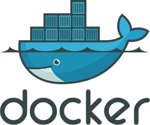
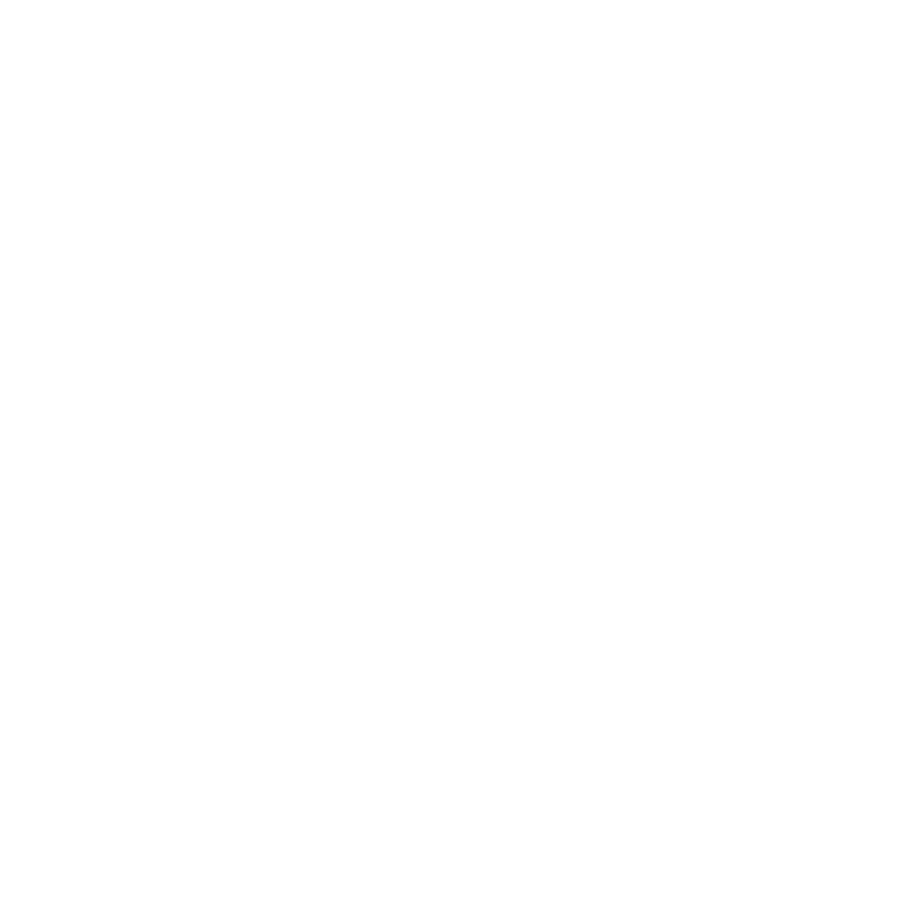

# Welcome to My Portfolio! 

## https://viillakc.github.io/VIILLAKC/

👋 Greetings, everyone! 🌟 

I'm excited to share my journey as an AI enthusiast and tech aficionado. 🚀 My passion revolves around crafting cutting-edge algorithms, bringing intelligence to pixels in the world of Computer Vision. 🔍🖼️

When I'm not immersed in AI intricacies, I'm leveraging my expertise to build robust backend systems for Python-based applications. 💼🐍 I harness the power of frameworks like FastAPI, Django, and Flask, ensuring our apps have a strong and steady heartbeat. With a keen eye on REST API design, I facilitate smooth communication between components for seamless user experiences. ✨🔗

But the journey doesn't end there! 🌐 I've also mastered Docker image creation, streamlining production deployments. 🚢🔧 The satisfaction of witnessing code transform into functional reality is what motivates me daily.

Curious minds, collaborators, and recruiters, please feel free to connect! Let's exchange ideas, explore opportunities, and together, create technology that transforms the world. 🌍🤝

## Skill Highlights

    
    
    
    
    
    
    
    
    
    
    

 
Let's make technology magic! ✨ #AI #ComputerVision #Python #FastAPI #Django #Flask #RESTAPI #Docker #TechEnthusiast

### Badges

    
    
    

